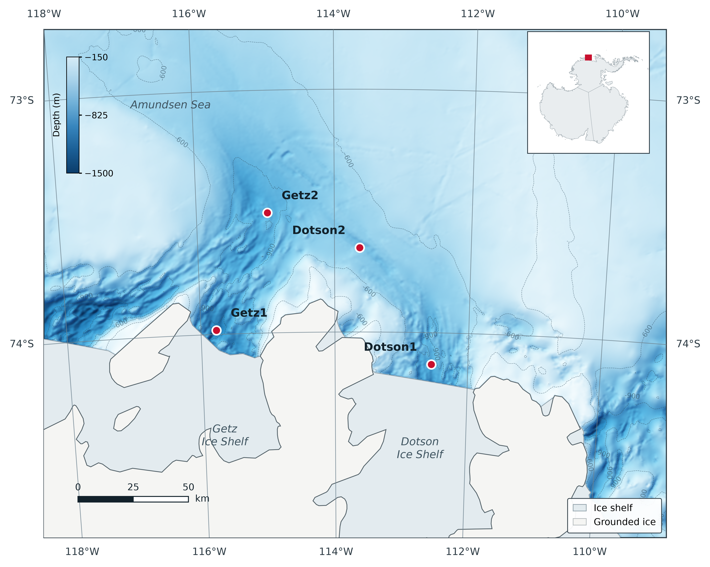

# Amundsen Sea coring-site location map

Python script that reproduces the site location map used in the accompanying
paper: sediment coring stations on the eastern Amundsen Sea continental shelf
(Getz and Dotson ice-shelf sectors), West Antarctica.



## What the script does

1. Reprojects a window of the IBCSO v2 bathymetric grid directly from
   EPSG:9354 into the map projection (no separate GDAL step needed).
2. Masks grid cells that fall beneath ice shelves or grounded ice, so that
   isobaths are not drawn across the ice sheet.
3. Renders hillshaded bathymetry with isobaths at 300 m intervals.
4. Overlays the coastline, ice-shelf and grounded-ice outlines, a graticule
   labelled along the frame, a scale bar corrected for the projection's scale
   factor at 74 S, the coring sites and an Antarctica inset.

## Map projection

Polar stereographic on WGS 84 with true scale at 71 S — the same definition as
EPSG:3031, but rotated so that the 113.7 W meridian is vertical, which puts
local north at the top of the figure:

```
+proj=stere +lat_0=-90 +lat_ts=-71 +lon_0=-113.7 +x_0=0 +y_0=0 +datum=WGS84 +units=m
```

Note that IBCSO v2 itself is distributed in EPSG:9354, whose standard parallel
is 65 S rather than the 71 S used by IBCSO v1 and EPSG:3031. The script handles
the conversion; do not assume the two are interchangeable.

## Coring sites

| Site | Latitude (S) | Longitude (W) | Decimal degrees |
|---|---|---|---|
| Getz1   | 73° 58.9692′ | 115° 46.1438′ | −73.982820, −115.769063 |
| Getz2   | 73° 30.2968′ | 114° 58.1766′ | −73.504947, −114.969610 |
| Dotson1 | 74° 07.8340′ | 112° 33.0079′ | −74.130567, −112.550132 |
| Dotson2 | 73° 39.1502′ | 113° 37.8846′ | −73.652503, −113.631410 |

Positions were recorded in degrees and decimal minutes on WGS 84.

## Requirements

```
numpy  matplotlib  pyproj  rasterio  pyshp
```

```bash
pip install numpy matplotlib pyproj rasterio pyshp
```

## Input data (not redistributed here)

Both datasets are freely available; download them into the working directory
before running the script.

**IBCSO v2 bed grid** — 500 m, EPSG:9354, CC-BY 4.0

```bash
curl -O https://download.pangaea.de/dataset/937574/files/IBCSO_v2_bed.tif
```

**Natural Earth 1:10 m physical vectors** — public domain

```bash
mkdir -p ne && cd ne
B=https://raw.githubusercontent.com/nvkelso/natural-earth-vector/master/10m_physical
for n in ne_10m_coastline ne_10m_antarctic_ice_shelves_polys ne_10m_glaciated_areas; do
  for e in shp shx dbf; do curl -sfLO $B/$n.$e; done
done
```

Natural Earth ice-shelf fronts are generalised and are not current. For work
that depends on the position of the calving front, replace them with the SCAR
Antarctic Digital Database or MEaSUREs outlines and change the `ICE_SHELF`
variable at the top of the script.

## Running

```bash
python3 make_site_map.py
```

Writes `amundsen_site_map.png` (600 dpi) and `amundsen_site_map.pdf`. Add
`"svg"` to the format tuple at the end of `main()` if you want to edit the
figure in a vector editor.

Map extent, contour levels, colour range, hillshade exaggeration and label
placement are all set in the `settings` block at the top of the file.

## Data sources and citation

If you use this script, please cite the underlying data:

> Dorschel, B., Hehemann, L., Viquerat, S., et al. (2022) The International
> Bathymetric Chart of the Southern Ocean Version 2 (IBCSO v2) [dataset].
> PANGAEA. https://doi.org/10.1594/PANGAEA.937574

> Dorschel, B., Hehemann, L., Viquerat, S., et al. (2022) The International
> Bathymetric Chart of the Southern Ocean Version 2. *Scientific Data* 9, 275.
> https://doi.org/10.1038/s41597-022-01366-7

Coastline, ice-shelf and grounded-ice outlines: Natural Earth
(https://www.naturalearthdata.com), public domain.

Figure rendering: Matplotlib (Hunter, J.D., 2007, *Computing in Science &
Engineering* 9(3), 90–95).

## License

Code released under the MIT License. The input datasets keep their own terms:
IBCSO v2 is CC-BY 4.0 and requires attribution; Natural Earth is public domain.
